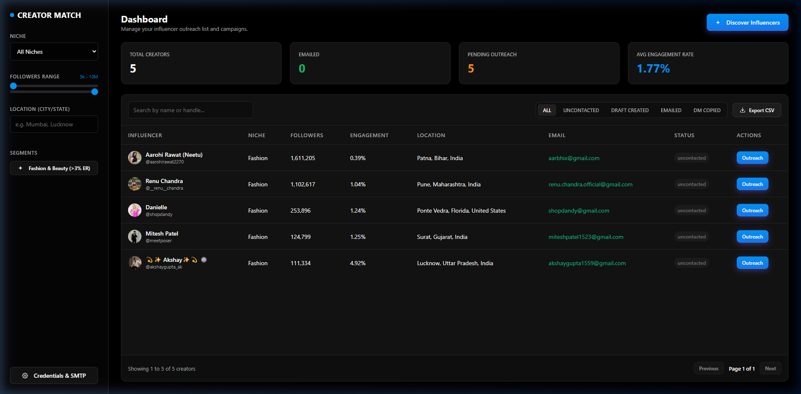
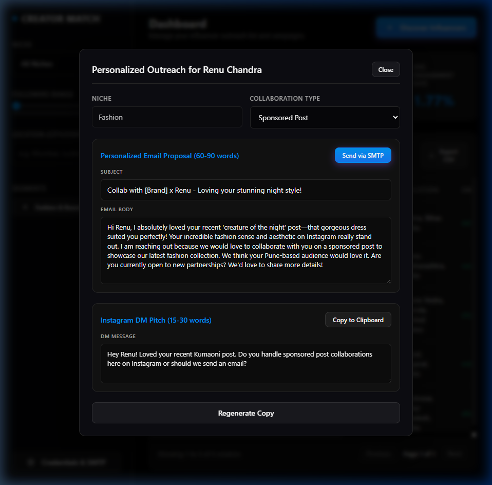
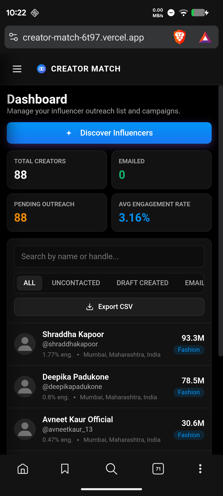
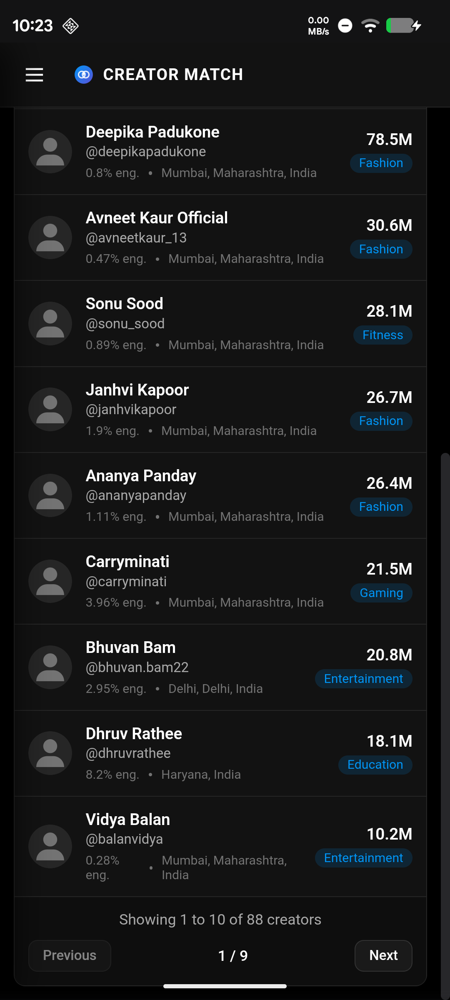
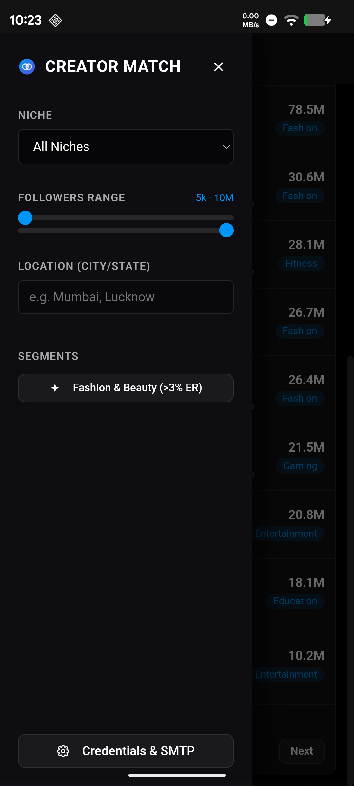
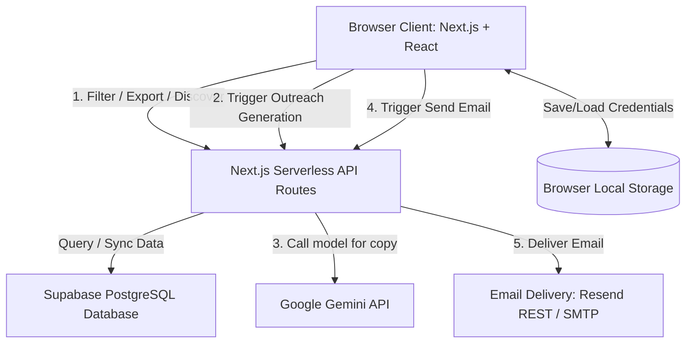

# Creator Match - Automated Micro-Influencer Discovery and Outreach Dashboard

[](https://youtu.be/4axsrArhS_E)

Creator Match is a premium web dashboard designed for discovering, organizing, and executing outreach campaigns for social media influencers. Built with Next.js (App Router), Supabase, Google Gemini AI, and Resend, the application automates the entire creator-sourcing and message-personalization lifecycle.

Live Deployment: https://creatormatch-app.vercel.app

---

## Release Assets & Quick Start Launcher

You can download pre-packaged assets and launchers directly from the [GitHub v1.0.0 Release Page](https://github.com/divyprj/creator-match/releases/tag/v1.0.0):

* **`launchers.zip`**: Contains the compiled launcher executables (`.exe`) styled with custom Creator Match icons. Download this to run the app from your local clone.
* **`creator-match.zip`**: A clean, fully packaged version of the entire codebase (excluding development caches) including the source files and launchers.

### How to use:
1. **Download & Extract**: Download `creator-match.zip` and extract it to a folder.
2. **Environment Setup**: Copy `.env.example` to `.env.local` and add your Supabase, Gemini, and SMTP credentials.
3. **Run Install**: Open the `launchers` folder and double-click **`install.exe`** to install all project dependencies.
4. **Start App**: Double-click **`run.exe`** inside the `launchers` folder. This will automatically start the Next.js server and launch the app in your browser at `http://localhost:3000`.
5. **Close App**: Double-click **`stop.exe`** to close the server and browser.

---

## Screenshots

### Main Dashboard


### Personalized Outreach Modal Powered by Gemini AI


### Mobile UI

<p align="center">
  
  &nbsp;&nbsp;
  
  &nbsp;&nbsp;
  
</p>

*Left: Mobile dashboard with stats grid and creator cards • Center: Scrollable creator list with pagination • Right: Glassmorphism sidebar drawer with filters*

---

## Core Features

### 1. Influencer Discovery Engine
* Whitelisted Niche Filtering: Validates input niches against accepted categories: Fashion, Beauty, Fitness, Food, Tech, Gaming, Finance, and Education.
* Independent Scraper Sources: Scrapes creator profile pages and analytics across Qoruz and StarNgage to build a comprehensive data set.
* Resilient Fallback System: Integrates a pre-seeded, curated registry of 10 to 15 real Indian creator profiles per niche (over 90 total profiles) to guarantee dashboard populates even when scraping engines encounter network/security blocks.

### 2. Live Filtering and Segmenting
* Followers Slider: Filters creator list in real-time across micro-influencer ranges from 5k up to 10M followers.
* Location Matching: Queries profiles dynamically by Indian city or state (e.g. Mumbai, Pune, Lucknow) to localize campaigns.
* High-Engagement Segment: Includes a single-click quick-filter for identifying high-performing Indian Fashion and Beauty creators with an engagement rate equal to or greater than 3.00 percent.
* Responsive Pagination: Implements clean pagination rendering 10 influencers per page to guarantee peak client performance.

### 3. Automatic Profile Enrichment
* Comprehensive Metrics: Pulls names, handles, profile images, follower totals, and engagement rates.
* Email Sourcing: Automatically extracts contact emails from creator bios. If a bio lacks an email, it constructs a clean handler fallback to keep the profile outreach-eligible.
* Content Snippets: Seeds and renders the three most recent posts for each creator to establish a baseline for content context.

### 4. Gemini AI Personalization
* Multi-Channel Output: Leverages gemini-flash-latest to dynamically generate a personalized 60-90 word collaboration email and a casual 15-30 word Instagram DM pitch.
* Context-Aware Copywriting: Analyzes the creator's specific niche, handle, bio keywords, and recent posts to ensure highly custom hooks.
* Credit Saver Configuration: Restricts automated API execution. The dashboard presents an explicit outreach generation trigger button, ensuring you only consume Gemini tokens when you decide to.

### 5. Sending Layer
* Native Resend REST API Client: Automatically detects Resend API keys (passwords starting with re_). Sends emails over direct HTTPS REST endpoints, eliminating datacenter IP blocks and SMTP connection timeouts.
* Nodemailer SMTP Client: Falls back to a standard SMTP transporter for personal mail hosting or custom mail servers.
* Sandbox Redirection Fallback: Detects Resend sandbox restrictions and automatically redirects emails to the verified account owner address with a Sandbox Redirect tag, preventing runtime crashes and ensuring full demo verification.
* Outreach Tracking: Commits attempts (subject, type, body, status) to the outreach_logs database table and updates the creator's status in real-time.

### 6. CSV Data Export
* Renders and compiles the currently filtered or searched influencer table into a downloadable CSV file.

### 7. Interactive Column Sorting
* Multi-Field Sorting: Users can click on table headers (Name, Niche, Followers, Engagement, Location) to sort ascending or descending.
* Visual Indicators: Displays direction arrows (↑/↓) next to the active sorted column header.

### 8. Live Niche Distribution Analytics
* Animated Visuals: Displays a horizontal bar chart visualizing the frequency of each niche in the current database.
* Dynamic Updates: Automatically adjusts in real-time as new creators are discovered or filters are modified.

### 9. Premium Toast Notifications
* Success & Error Toasts: Replaces standard alert dialogs with custom, animated, glassmorphic toast notification cards.
* Mobile-Responsive: Repositioned to center-bottom on mobile viewports for optimal thumb reach.

---

## Technology Stack

| Layer | Technology |
|---|---|
| Frontend | Next.js 16 (App Router), React 19, TypeScript |
| Styling | Vanilla CSS |
| Database | Supabase (PostgreSQL) |
| AI Personalization | Google Generative AI SDK (gemini-flash-latest) |
| Mail Delivery | Nodemailer SMTP, Resend HTTPS REST API |
| Deployment | Vercel |

---

## System Architecture

The following block diagram illustrates the flow of requests and data integration across the application:



### Components Description

* **Client Layer (Next.js/React):** Single-page dashboard built with React 19 Client Components. Manages state for search, followers range, locations, and modal popups. Reads/writes SMTP configuration and the Gemini API key locally to `localStorage` for privacy and persistence.
* **Serverless Backend (Next.js Route Handlers):** Processes discovery queries, calls the data sourcing adapters, invokes the Google Generative AI SDK, and establishes connections to the selected mail transport (Resend or SMTP).
* **Database Layer (Supabase):** Renders raw PostgreSQL tables with pre-defined schemas and Row-Level Security (RLS) enabled. Maintains records for influencer profiles, content snippets, and campaign logs.
* **External API Integration:**
  * **Gemini API:** Generates context-rich outreach emails and DM copy.
  * **Resend & Nodemailer SMTP:** Powers the communication delivery subsystem.

---

## Project Structure

```
creator-match/
  public/
    screenshots/          -- Dashboard and outreach modal screenshots
  src/
    app/
      page.tsx             -- Main dashboard page
      api/
        discovery/
          search/route.ts  -- Influencer search and import endpoint
          enrich/route.ts  -- Profile enrichment endpoint
        outreach/
          generate/route.ts -- Gemini AI outreach generation endpoint
          send-email/route.ts -- SMTP and Resend email sending endpoint
        export/
          csv/route.ts     -- CSV export endpoint
    lib/
      supabaseClient.ts   -- Supabase client initialization
    types.ts              -- Shared TypeScript interfaces
    tests/
      test_supabase.js    -- Supabase connectivity test
      test_gemini.js      -- Gemini API test
      test_smtp.js        -- SMTP connectivity test
  supabase/
    schema.sql            -- Database schema and RLS policies
  launchers/              -- Directory containing all launchers and batch scripts (styled with custom icons)
    install.bat / .exe     -- Dependency installer
    run.bat / .exe         -- Start dev server and open browser
    stop.bat / .exe        -- Stop dev server and close browser
    uninstall.bat / .exe   -- Remove dependencies and build cache
    repair.bat / .exe      -- Revert to last working GitHub version
    create_shortcuts.bat / .exe -- Create desktop shortcuts on Windows
```

---

## Database Architecture

Create the following tables and Row-Level Security (RLS) policies in your Supabase SQL editor. The schema SQL is located in `supabase/schema.sql`.

```sql
-- 1. Create the influencers table
CREATE TABLE IF NOT EXISTS public.influencers (
    id BIGINT GENERATED ALWAYS AS IDENTITY PRIMARY KEY,
    handle TEXT UNIQUE NOT NULL,
    name TEXT NOT NULL,
    email TEXT,
    followers_count INTEGER NOT NULL,
    engagement_rate NUMERIC,
    engagement_rate_str TEXT,
    location TEXT,
    niche TEXT NOT NULL,
    bio TEXT,
    profile_image TEXT,
    recent_posts JSONB DEFAULT '[]'::jsonb,
    outreach_status TEXT DEFAULT 'uncontacted' CHECK (outreach_status IN ('uncontacted', 'draft_created', 'emailed', 'dm_copied')),
    created_at TIMESTAMP WITH TIME ZONE DEFAULT timezone('utc'::text, now()) NOT NULL,
    updated_at TIMESTAMP WITH TIME ZONE DEFAULT timezone('utc'::text, now()) NOT NULL
);

-- 2. Create the outreach_logs table
CREATE TABLE IF NOT EXISTS public.outreach_logs (
    id BIGINT GENERATED ALWAYS AS IDENTITY PRIMARY KEY,
    influencer_id BIGINT REFERENCES public.influencers(id) ON DELETE CASCADE,
    type TEXT NOT NULL CHECK (type IN ('email', 'dm')),
    subject TEXT,
    content TEXT NOT NULL,
    status TEXT DEFAULT 'draft' CHECK (status IN ('draft', 'sent')),
    created_at TIMESTAMP WITH TIME ZONE DEFAULT timezone('utc'::text, now()) NOT NULL
);

-- 3. Enable Row-Level Security
ALTER TABLE public.influencers ENABLE ROW LEVEL SECURITY;
ALTER TABLE public.outreach_logs ENABLE ROW LEVEL SECURITY;

-- 4. Set access control policies
CREATE POLICY "Enable all access for anon users on influencers"
ON public.influencers FOR ALL USING (true) WITH CHECK (true);

CREATE POLICY "Enable all access for anon users on outreach_logs"
ON public.outreach_logs FOR ALL USING (true) WITH CHECK (true);
```

---

## System Requirements

Before setting up the project, make sure you have the following prerequisites installed and configured:

* **Runtime:** Node.js `>= 18.17.0` (LTS version `20.x` or `22.x` is highly recommended).
* **Package Manager:** `npm` (comes with Node) or `yarn`.
* **Database:** An active [Supabase](https://supabase.com/) project with the SQL schema in `supabase/schema.sql` applied.
* **API Credentials:**
  * A valid **Google Gemini API Key** from [Google AI Studio](https://aistudio.google.com/) (starts with `AIzaSy`).
  * A **Resend API Key** (starts with `re_`) or standard **SMTP credentials** (e.g. Gmail App Password) for email delivery.

---

## Environment Setup

Create a `.env.local` file in the root directory:

```env
# Supabase Configuration
NEXT_PUBLIC_SUPABASE_URL=https://your-supabase-project-id.supabase.co
NEXT_PUBLIC_SUPABASE_ANON_KEY=your-supabase-anon-public-key

# Gemini API Configuration
GEMINI_API_KEY=your-google-gemini-api-key

# Email Sending Configuration (SMTP or Resend API Key)
SMTP_HOST=smtp.resend.com
SMTP_PORT=465
SMTP_USER=resend
SMTP_PASS=your-resend-api-key-starting-with-re_
```

---

The project includes compiled executable launchers (`.exe`) and their corresponding batch scripts, located inside the **`launchers`** subdirectory. These executables are beautifully styled with the custom **Creator Match icon** so they display properly in Windows File Explorer:

| Launcher (.exe) | Script (.bat) | Description |
|---|---|---|
| `launchers/install.exe` | `launchers/install.bat` | Installs all project dependencies and verifies environment configuration. |
| `launchers/run.exe` | `launchers/run.bat` | Starts the development server and automatically opens the browser to localhost:3000. |
| `launchers/stop.exe` | `launchers/stop.bat` | Stops the development server and closes the browser tab. |
| `launchers/uninstall.exe` | `launchers/uninstall.bat` | Removes node_modules, .next build cache, and package-lock.json. |
| `launchers/repair.exe` | `launchers/repair.bat` | Reverts all source code to the latest working version from GitHub, preserves .env.local, and reinstalls dependencies. |
| `launchers/create_shortcuts.exe` | `launchers/create_shortcuts.bat` | Generates desktop shortcuts for all scripts, styled with the custom Creator Match icon. |

You can double-click either the `.exe` or `.bat` files directly inside the `launchers` directory in File Explorer.

---

## Manual Setup

1. Install project dependencies:
   ```bash
   npm install
   ```
2. Launch the local development server:
   ```bash
   npm run dev
   ```
3. Open http://localhost:3000 in your web browser.

---

## API Routes

### 1. Discover Search
* Endpoint: POST /api/discovery/search
* Description: Searches and imports creators into Supabase based on niche and location.
* Payload:
  ```json
  {
    "niche": "Fashion",
    "location": "Mumbai"
  }
  ```

### 2. Discover Enrich
* Endpoint: POST /api/discovery/enrich
* Description: Enriches profiles with contact details, statistics, and recent content.
* Payload:
  ```json
  {
    "handle": "aarohirawat2270"
  }
  ```

### 3. Generate Outreach
* Endpoint: POST /api/outreach/generate
* Description: Generates personalized DM and Email proposals via Gemini API.
* Payload:
  ```json
  {
    "creatorId": "123",
    "collabType": "Sponsored Post"
  }
  ```

### 4. Send Email
* Endpoint: POST /api/outreach/send-email
* Description: Sends outreach proposals via SMTP or Resend API.
* Payload:
  ```json
  {
    "creatorId": "123",
    "subject": "Collaboration Offer",
    "body": "Email body content"
  }
  ```

---

## Deployment

The application is deployed on Vercel with the following environment variables configured in the Vercel project dashboard:

* NEXT_PUBLIC_SUPABASE_URL
* NEXT_PUBLIC_SUPABASE_ANON_KEY
* GEMINI_API_KEY
* SMTP_HOST
* SMTP_PORT
* SMTP_USER
* SMTP_PASS

Live URL: https://creatormatch-app.vercel.app

---

## License

This project is licensed under the MIT License.
