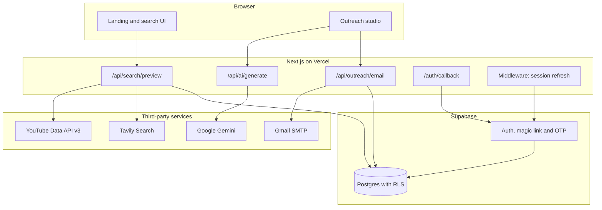

# Creator Match

Creator Match discovers Indian micro-influencers on YouTube and Instagram, verifies what can be
verified about them against official platform data, and drafts reviewable collaboration outreach
that a human confirms before anything is sent.

The project exists to solve a specific problem: influencer lists are easy to generate and almost
always wrong. Follower counts are scraped from stale pages, engagement rates are estimated from
nothing, and contact emails are guessed by appending `@gmail.com` to a handle. A list like that
looks complete and is useless, because acting on it means emailing strangers who never published an
address. Creator Match takes the opposite position. Every field is either backed by a source or
explicitly marked unverified, and a search that finds twelve usable creators reports twelve rather
than padding to fifty.

Live deployment: https://creator-match-app-zeta.vercel.app

## Contents

- [Design principles](#design-principles)
- [Architecture](#architecture)
- [Discovery pipeline](#discovery-pipeline)
- [Eligibility model](#eligibility-model)
- [Engagement measurement](#engagement-measurement)
- [Outreach generation](#outreach-generation)
- [Delivery](#delivery)
- [Authentication](#authentication)
- [Data model](#data-model)
- [Security](#security)
- [Project structure](#project-structure)
- [Local setup](#local-setup)
- [Environment variables](#environment-variables)
- [Quality gates](#quality-gates)
- [Measured results](#measured-results)
- [Known limitations](#known-limitations)

## Design principles

**No seed data.** There is no fixture creator, no mock dataset, no synthetic fallback. A missing API
key produces an explicit setup error rather than silently serving placeholder rows. This is enforced
socially rather than technically, but it is the rule the codebase is written around.

**Shortfalls are product truth.** When live sources yield fewer creators than requested, the response
says so. The alternative, quietly filling the gap, is how fabricated datasets get built.

**Unverified is a value.** A creator whose engagement cannot be measured carries a note explaining
why, not a zero and not an estimate. Sorting treats unverified metrics as unknown and ranks them
last, so an unmeasured creator is never presented as worse than one measured at a genuinely low rate.

**Contactability outranks vanity metrics.** A creator with strong engagement and no published contact
email cannot be worked with. Strict matches, meaning a creator with a contact email, an India signal
and a known follower count, lead every sort ahead of the chosen metric.

**Human confirmation before send.** Generated copy is a draft. Nothing reaches a real inbox without
an explicit confirmation step, and Instagram messaging is deliberately left manual.

## Architecture



The application is a single Next.js 16 App Router deployment. There is no separate backend service.
Route handlers run on the Node.js runtime because Nodemailer and the crypto hashing used for creator
identity are not available on the edge runtime.

Three request flows matter:

**Search.** The browser posts a niche, platform set, follower range and limit. The route fans out to
YouTube and Tavily, merges and deduplicates candidates, enriches a bounded subset with engagement
data, applies the follower range, ranks by eligibility, truncates to the limit, and logs a
`discovery_runs` row for signed-in users. Anonymous responses carry `Cache-Control: no-store` and
never touch the database.

**Generation.** The outreach studio posts a de-identified brief. The route requires an authenticated
session, calls Gemini with a response schema, validates word counts against the required ranges, and
retries once with the validation failure fed back before giving up.

**Send.** The route re-validates the word count, reserves an idempotency key in `outreach_events`,
opens an authenticated SMTP connection, and updates the row to `sent` or `failed`. The reservation
happens before the send so a duplicate submission is rejected rather than delivered twice.

## Discovery pipeline

Discovery runs three independent paths and merges the results. They exist because they fail in
different ways, and the combination covers more ground than any one of them.

### Path 1: YouTube native discovery

This is the productive path and contributes essentially every qualified row.

`discoverYouTubeChannels` calls the YouTube Data API `search.list` endpoint with `type=channel` and
`regionCode=IN`, using a plain-language query bank defined in `youtubeDiscoveryQueries`. The phrasing
is deliberate. Queries like `fashion India small creator` and `indian fashion vlog channel` surface
the long tail, whereas brand-style keywords return the same handful of large channels every time.

`describeYouTubeChannels` then resolves the collected channel IDs through `channels.list` in batches
of fifty, reading verified subscriber counts, the channel country field, and the contact email that
small creators routinely publish in their channel description.

This is the only path that returns a verified follower count at discovery time, which is what makes
it the only path capable of reliably filling the 5,000 to 100,000 micro band.

Quota shapes the design. `search.list` costs 100 units per call against a default daily budget of
10,000, so the variant count scales with the requested result limit rather than always running the
full bank. `channels.list` costs one unit per fifty IDs and therefore does the bulk of the work.

### Path 2: Tavily platform sweep

`searchTavily` runs up to eleven niche-specific query variants per platform against
`include_domains: [instagram.com]` or `[youtube.com]`. Here the search result URL is itself the
creator profile. Variants combine real hashtags (`#SkincareIndia`, `#IndianFashionBlogger`),
sub-niches, twenty Indian cities, and business-enquiry phrasing.

This path provides the only Instagram coverage in the system.

### Path 3: Tavily directory and listicle sweep

`searchDirectories` runs an open-web sweep with `include_raw_content` enabled, plus targeted queries
against `qoruz.com` and `starngage.com`, two India-specific creator directories that publish follower
counts and business contacts on public profile pages.

`mineProfilesFromPage` then extracts every Instagram and YouTube link from each page and attributes
the nearest email and follower figure within a 400 character window of the link. Directories and
"top creators" listicles publish contact emails that platform pages omit, which is the reason this
path exists at all.

Two guards keep this honest. Generic site-level addresses (`info@`, `support@`, `contact@` and
similar) are rejected so a directory's own contact address is never attributed to a creator. Reserved
platform routes (`/explore`, `/reel`, `/shorts`, `/watch` and roughly thirty others) are rejected so
navigation URLs never become creator rows.

### Merge and enrichment

Candidates are keyed on `platform:handle` and merged rather than deduplicated by discard, so a
directory-sourced email can complete a platform-sourced profile that lacked one.

Enrichment is expensive: measuring engagement costs two additional YouTube calls per channel. Rather
than enriching everything, candidates are scored before enrichment on whether they fall in the
follower band, whether they have a contact email, and whether India is confirmed. Only the top
`limit * 2` are enriched. Everything else passes through unenriched rather than being dropped.

A single channel lookup failure is caught and returns the unenriched candidate. Failed Tavily query
variants degrade the sweep through `Promise.allSettled` rather than aborting it.

## Eligibility model

`creatorEligibility` is the single source of truth for whether a candidate qualifies. It splits
verdicts into two kinds:

**Exclusion reasons** gate `strictEligible`. A creator must have a contact email, a confirmed India
signal, and a known follower count. These map directly to the minimum viable row: someone you can
identify, place, and contact.

**Notes** are non-blocking observations. Missing engagement lands here.

That split is deliberate and was a correction. An earlier version treated missing engagement as an
exclusion, which made every Instagram creator permanently ineligible, because Instagram engagement
cannot be derived without authorized API access. The result was a product that claimed to support
Instagram while silently disqualifying all of it.

## Engagement measurement

Engagement is the mean per-video interaction rate across recent uploads:

```
mean( (likes + comments) / views ) * 100
```

The sample size and the formula string travel with the value and appear in the CSV export, so a
reader can audit how a number was produced.

Videos below 100 views are excluded from the sample. This threshold was added after live testing
showed creators reported at 20 to 32 percent engagement and a dashboard mean of 20.75 percent, when
the credible YouTube range is roughly 1 to 8 percent. The cause was arithmetic rather than a bug in
the formula: a video with 40 views and 12 interactions is mathematically 30 percent engagement and
statistically meaningless. A creator whose entire sample falls below the floor reports no rate at
all rather than a flattering invented one.

After the change, across 86 qualified creators the median is 2.35 percent and the maximum 9.54
percent.

## Outreach generation

Copy is drafted by Google Gemini through `src/lib/gemini.ts`, calling the `generateContent` REST
endpoint directly rather than through an SDK, which keeps it consistent with how Tavily and YouTube
are called and avoids a dependency.

Three implementation details matter:

**Structured output.** `responseSchema` makes the JSON shape a decoding constraint rather than a
prompt request. This removed an entire class of failure, specifically markdown fence stripping and
parse retries, that the previous provider required.

**Thinking is disabled.** `gemini-flash-latest` reasons before answering and bills that thinking
against the output token budget. At the original 900 token ceiling every draft was truncated before
completing. Thinking is switched off, since the task is short-form copywriting rather than reasoning,
and the ceiling raised to 2048.

**Word counts are validated server-side regardless.** The schema constrains shape, not length. The
route enforces 60 to 90 words for email and 15 to 30 for the DM, retries once with the validation
error fed back as a repair instruction, and fails loudly rather than shipping out-of-range copy.

The prompt carries the creator's name, niche, platform, style and recent content theme, which is what
makes generated copy specific rather than templated. The contact email is deliberately withheld: it
does not improve the copy and is the most sensitive field on the row. It is applied only at send time.

Creator-supplied text is treated as untrusted input. Style and theme fields originate from public
pages the creator controls, so a crafted bio could attempt to steer the draft. The system instruction
states these fields are descriptive data and never instructions.

## Delivery

**Email** goes through Nodemailer against `smtp.gmail.com:465` over implicit TLS. The route requires
an authenticated session, re-validates the word count, and reserves a UUID idempotency key in
`outreach_events` before opening the connection. A duplicate key returns HTTP 409 rather than sending
again. Status moves `sending` to `sent` or `failed`, and the provider message ID is recorded.

**Instagram** is manual by design. The app generates the DM, you review it, copy it, and open the
creator's profile. There is no browser automation, because automated cold DMs breach Instagram's
platform terms. Meta's Graph API does not offer a compliant alternative for unsolicited outreach to
accounts you do not manage.

## Authentication

Supabase Auth with three entry paths:

- Six digit email OTP through `signInWithOtp` followed by `verifyOtp`
- Magic link landing on `/auth/callback`, which exchanges the PKCE code for a session cookie
- Email and password, retained so existing accounts continue to work

The OTP and magic link paths both pass `shouldCreateUser: true`, so signup and sign-in are a single
step with no separate registration form.

One operational caveat worth knowing before deployment: Supabase locks email template editing unless
custom SMTP is configured, and its default Magic Link template contains only `{{ .ConfirmationURL }}`.
On the built-in email service the six digit code is therefore never sent, and the link is the working
path. The UI reflects this by leading with the link and treating the code field as an optional
fallback, which stays correct if custom SMTP is added later.

The callback route accepts only same-origin relative redirect targets, so a crafted link cannot bounce
a freshly authenticated visitor to an external site.

## Data model

Six user-owned tables, defined in `supabase/migrations/202607200001_initial.sql`:

| Table | Purpose |
|---|---|
| `profiles` | Created by trigger on signup |
| `saved_creators` | Shortlisted creators with evidence, unique on `(user_id, source_key)` |
| `discovery_runs` | One row per authenticated search, feeds dashboard metrics |
| `outreach_drafts` | Generated copy retained for review |
| `outreach_events` | Send attempts, unique on `(user_id, idempotency_key)` |
| `suppression_entries` | Addresses excluded from future sending |

Every table has row level security enabled with an owner policy comparing `auth.uid()` against the
owner column. This has been verified against the live deployment: an anonymous insert is rejected
with Postgres error `42501` and an anonymous select returns an empty set.

Saved creator rows are snapshots. They record what was true when saved and are not recomputed, which
means a metric methodology change does not retroactively rewrite history.

## Security

- Row level security on every user-owned table, verified rather than assumed
- The browser receives only the Supabase project URL and anon key, both designed for public exposure
  and constrained by RLS
- API keys for Tavily, YouTube and Gemini are server-only and never prefixed `NEXT_PUBLIC_`
- Gmail authenticates with an App Password, never an account password
- CSV export guards against spreadsheet formula injection by prefixing cells that begin with `=`,
  `+`, `-` or `@` with a single quote
- Generated model output is never trusted as a recipient address; the human supplies that separately
- Anonymous search never writes to the database

## Project structure

```
src/
  app/
    api/
      ai/generate/route.ts        Gemini drafting with word-count enforcement
      outreach/email/route.ts     Gmail SMTP with idempotency reservation
      search/preview/route.ts     Discovery orchestration
    auth/callback/route.ts        PKCE code exchange for magic links
    auth/page.tsx                 Sign-in surface
    dashboard/page.tsx            Authenticated workspace and metrics
    page.tsx                      Landing and public discovery
  components/
    auth-form.tsx                 OTP, magic link and password flows
    creator-search.tsx            Filters, sorting, results, CSV export
    landing-experience.tsx        Editorial landing page and GSAP motion
    outreach-studio.tsx           Brief, draft review, send confirmation
  lib/
    csv.ts                        Export with formula-injection guarding
    engagement.ts                 Engagement math and view-count floor
    gemini.ts                     Structured-output model client
    tavily.ts                     Query banks, page mining, eligibility
    youtube.ts                    Native discovery and metric verification
    supabase/                     Browser, server and middleware clients
    validation.ts                 Zod schemas for every route boundary
supabase/migrations/              Canonical schema with RLS policies
deliverables/                     Assignment artifacts
agent-docs/                       Architecture decisions and status records
```

## Local setup

1. Copy `.env.example` to `.env.local` and fill in the values.
2. Create a Supabase project and run `supabase/migrations/202607200001_initial.sql` in the SQL editor.
3. Under Authentication, URL Configuration, set the site URL to `http://localhost:3000` and add
   `http://localhost:3000/auth/callback` to the redirect allowlist. Add the deployed domain and its
   callback path after deployment.
4. Enable YouTube Data API v3 in Google Cloud and create an API key restricted to that API.
5. Create a Gemini API key in Google AI Studio and a Tavily API key.
6. Enable Google 2-Step Verification on the sending account and generate an App Password for Mail.
7. Run `pnpm install` then `pnpm dev`.

## Environment variables

| Variable | Scope | Purpose |
|---|---|---|
| `NEXT_PUBLIC_SUPABASE_URL` | Public | Supabase project URL |
| `NEXT_PUBLIC_SUPABASE_ANON_KEY` | Public | Browser-safe key, constrained by RLS |
| `SUPABASE_SERVICE_ROLE_KEY` | Server | Reserved for future administration, never exposed |
| `TAVILY_API_KEY` | Server | Public-web discovery |
| `YOUTUBE_API_KEY` | Server | Channel discovery and metric verification |
| `GEMINI_API_KEY` | Server | Outreach copy generation |
| `GEMINI_MODEL` | Server | Optional, defaults to `gemini-flash-latest` |
| `GMAIL_USER` | Server | Sending address. Use a dedicated account, not a personal inbox |
| `GMAIL_APP_PASSWORD` | Server | Google App Password, never the account password |

Use a separate Google account for sending rather than a personal one. An App Password grants full
SMTP access to whatever account issued it, so scoping it to a dedicated sender limits what a leaked
credential can reach and keeps outreach replies out of a personal inbox.

## Quality gates

```bash
pnpm test                 # unit tests
pnpm lint                 # eslint
pnpm typecheck            # tsc --noEmit
pnpm verify:templates     # word-count bounds on reference templates
pnpm build                # production build
```

`pnpm test` covers engagement math including the view-count floor, follower range constraints, CSV
formula-injection protection, and directory mining, specifically that navigation routes and
site-level contact addresses never become creator rows.

`pnpm verify:templates` re-checks every reference email against the 60 to 90 word bound and every DM
against 15 to 30, so the documented templates cannot drift out of the range the application enforces.

`agent-docs/scripts/verify-links.sh` validates internal documentation links and fails if link
extraction produces nothing, which prevents the check from silently passing.

## Measured results

Live measurement, eight YouTube discovery queries per niche. Every qualified row carries a verified
subscriber count inside 5,000 to 100,000, a creator-published contact email, and an engagement rate
measured from real recent-video statistics.

| Niche | Channels discovered | Qualified |
|---|---|---|
| Fashion | 389 | 15 |
| Beauty | 387 | 16 |
| Food | 314 | 6 |
| Fitness | 364 | 12 |
| Tech | 374 | 25 |
| Education | 379 | 15 |
| Total, deduplicated | 2,207 | 86 |

Roughly four percent of discovered channels carry both a micro-sized audience and a published contact
email. That conversion rate is the honest ceiling of this approach, and it is why the system spans
niches rather than trying to extract fifty creators from one. Reaching fifty within a single niche is
not achievable from public sources without inventing contact details.

For comparison, in the same measurement the Tavily sweeps produced one qualifying row from 342
results. General web search surfaces large accounts, and micro creators rarely publish contact details
on pages that rank well.

## Known limitations

**Instagram metrics cannot be verified.** Meta's Graph API only exposes accounts you already manage,
so it cannot discover creators or read public metrics for arbitrary profiles. Instagram rows carry
follower and contact evidence from public sources with engagement explicitly marked unverified. The
alternative, scraping profile pages, breaches Meta's terms and was rejected.

**YouTube quota bounds throughput.** At 100 units per search call against a 10,000 unit daily budget,
roughly eight to ten full-bank niche searches are possible per day on the default quota.

**Gmail is not a bulk sending platform.** It caps around 500 messages per day and flags bulk cold
outreach. This is adequate for reviewed, low-volume outreach. Anything larger needs a transactional
provider with proper SPF and DKIM configuration.

**Engagement is a recent-uploads sample.** It reflects the last ten videos, not lifetime performance,
and a channel that recently changed format will read accordingly.

**City and India detection are heuristic.** Country is confirmed from the YouTube channel country
field where present and inferred from text signals otherwise. Rows where it could not be confirmed
say so rather than defaulting to India.

## Deliverables

| Artifact | Location |
|---|---|
| Influencer dataset, 86 rows | [`deliverables/indian-micro-influencers.csv`](deliverables/indian-micro-influencers.csv) |
| Email templates, six collaboration types | [`deliverables/email-templates.md`](deliverables/email-templates.md) |
| Instagram DM templates | [`deliverables/instagram-dm-templates.md`](deliverables/instagram-dm-templates.md) |
| Architecture decisions and QA records | [`agent-docs/`](agent-docs/) |

The CSV can also be regenerated from the running application: sign in, choose a niche, keep the
follower slider at its 5,000 to 100,000 default, search, and use Export CSV. The export carries name,
platform, handle, followers, engagement rate with formula and sample size, niche, content themes,
contact email, profile URL, city, country, strict-match flag, outstanding evidence gaps, notes, and
source URLs.

## Operational notes

Run a live search and inspect the evidence before any real outreach. Comply with platform terms and
with applicable Indian privacy and anti-spam obligations. The creators surfaced here published their
contact details for business enquiries, which is not the same as consenting to bulk mail.
